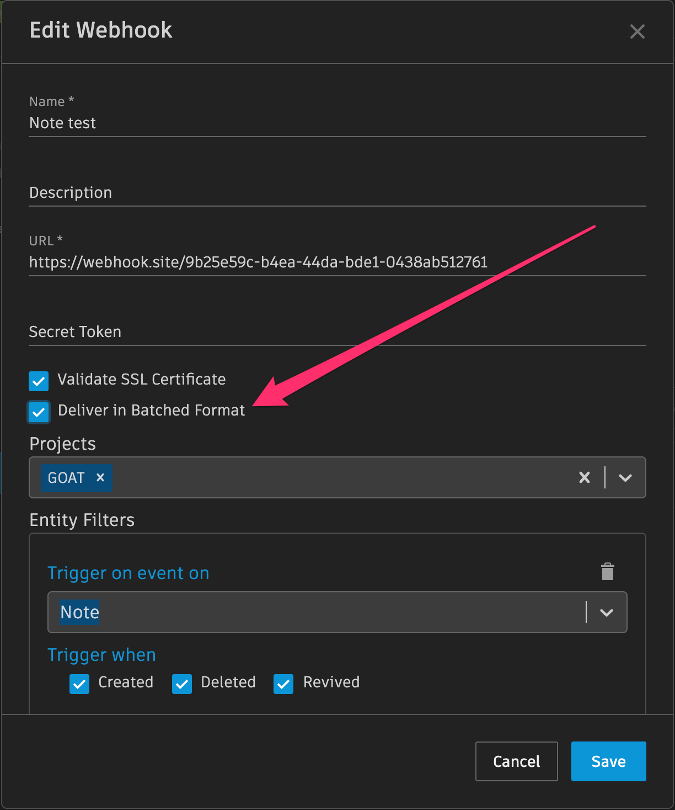

# Batch Delivery

## Enabling Batch Delivery

You can choose to configure your webhook so that it will make requests with a batched payload format, by selecting the "Deliver in Batched Format" option.
If enabled, at the time each request is formed, it will batch up to 50 pending deliveries into its payload.

This can help with managing the processing of large bursts of deliveries as a result of many SG events being generated in a short amount of time. Under typical system operation, multiple deliveries per payload will occur when subscribed events are generated more frequently than once in a 2 second period.



## Responding to deliveries

If enabling batched deliveries, we recommend that your receiving service design guarantees a response much faster than 1 second per event. Otherwise, you will be at increased risk for timeouts and webhook failure when batches are large.



#### Non-batched-deliveries Webhooks
* timeout allowance is 6 seconds per delivery. i.e. a webhook endpoint must respond to each request within 6 seconds.

#### Batched-deliveries Webhooks
* timeout allowance is the maximum of: 6 seconds, or, 1 second per event in the batch.
* throttling limits still apply (1 minute of webhook endpoint response time per minute per shotgun site, across all webhooks).

## Comparison of Webhook Delivery Formats

#### Non-batched-deliveries Webhook Message Body (always 1 delivery):

```json
{
  "data":{
    "id":"119.110.0",
    "event_log_entry_id":479004,
    "event_type":"Shotgun_Asset_Change",
    "operation":"update",
    "user":{"type":"HumanUser","id":24},
    "entity":{"type":"Asset","id":1419},
    "project":{"type":"Project","id":127},
    "meta":{
      "type":"attribute_change",
      "attribute_name":"code",
      "entity_type":"Asset",
      "entity_id":1419,
      "field_data_type":"text",
      "old_value":"Cypress test asset for Webhooks deliveries",
      "new_value":"Revised test asset for Webhooks deliveries"
    },
    "created_at":"2021-02-22 17:40:23.202136",
    "attribute_name":"code",
    "session_uuid":null,
  },
  "timestamp":"2021-02-22T17:40:27Z"
}
```

#### Batched-deliveries Webhook Message Body (may contain 1 to 50 deliveries)

When batching is enabled, a `deliveries` key is always present (even if there is only 1 event in the batch). Its value is an array of individual event delivery data, where the information provided for each delivery is identical to un-batched mode. 

```json
{
  "timestamp":"2021-02-22T18:04:40.140Z",
  "data":{
    "deliveries":[
      {
        "id":"170.141.0",
        "event_log_entry_id":480850,
        "event_type":"Shotgun_Asset_Change",
        "operation":"update",
        "user":{"type":"HumanUser","id":24},
        "entity":{"type":"Asset","id":1424},
        "project":{"type":"Project","id":132},
        "meta":{
          "type":"attribute_change",
          "attribute_name":"code",
          "entity_type":"Asset",
          "entity_id":1424,
          "field_data_type":"text",
          "old_value":"Cypress test asset for Webhooks deliveries",
          "new_value":"Revised test asset for Webhooks deliveries"
        },
        "created_at":"2021-02-22 18:04:39.198641",
        "attribute_name":"code",
        "session_uuid":null,
      },
      {
        "id":"170.141.1",
        "event_log_entry_id":480851,
        "event_type":"Shotgun_Asset_Change",
        "operation":"update",
        "user":{"type":"HumanUser","id":24},
        "entity":{"type":"Asset","id":1424},
        "project":{"type":"Project","id":132},
        "meta":{
          "type":"attribute_change",
          "attribute_name":"description",
          "entity_type":"Asset",
          "entity_id":1424,
          "field_data_type":"text",
          "old_value":null,
          "new_value":"Some other *description*"
        },
        "created_at":"2021-02-22 18:04:39.212032",
        "attribute_name":"description",
        "session_uuid":null,
      },
    ]
  }
}
```
